<div align="center">

<!-- Custom Adaptive Hero Banner (Light & Dark Theme Compatible) -->
<a href="https://ilakkiyan.tech/">
  <picture>
    <source media="(prefers-color-scheme: dark)" srcset="./assets/hero-dark.svg">
    <source media="(prefers-color-scheme: light)" srcset="./assets/hero-light.svg">
    
  </picture>
</a>

<br/>

<!-- Modern Pill Navigation Badges -->
<a href="https://ilakkiyan.tech/">
  
</a>
&nbsp;
<a href="https://www.linkedin.com/in/ilakkiyan-j">
  
</a>
&nbsp;
<a href="mailto:ilakkiyanj03@gmail.com">
  
</a>
&nbsp;
<a href="https://leetcode.com/ilakkiyan-j">
  
</a>

<br/><br/>


</div>

<br/>

---

## ⚡ Executive Summary

> I am an **AI Product Engineer** specializing in bridging the gap between raw machine intelligence and responsive production software. My work spans **local LLM orchestration, agentic autonomy, vector retrieval (RAG)**, and **type-safe backend architecture** through to desktop and web interfaces.

<br/>

<div align="center">

<!-- Bento Quick Specs Grid -->
<table width="100%">
<tr>
<td width="50%" valign="top">

### 🎓 Engineering & Foundations
- **Institution:** Karpagam College of Engineering *(Coimbatore, TN)*
- **Degree:** B.E. Computer Science & Design (Expected Apr 2026)
- **Academic Merit:** 8.5 / 10 CGPA
- **Location:** Thiruvarur / Coimbatore, Tamil Nadu, India

</td>
<td width="50%" valign="top">

### 🧠 Algorithmic Problem Solving
- **LeetCode Rating:** 1641 *(Top tier contest rating)*
- **DSA Solved:** 700+ algorithmic problems across LeetCode & GFG
- **Core Strengths:** Graphs, Dynamic Programming, Tree Traversal, High-efficiency data structures

</td>
</tr>
<tr>
<td width="50%" valign="top">

### 🔬 Research & Publications
- **Conference:** ICIRCA 2026
- **Paper:** *"Medorc: A Digital-Twin-Driven Framework for Real-Time Health Data Orchestration"*
- **Domain:** Healthcare IoT, digital twins, event streams, secure clinical data routing

</td>
<td width="50%" valign="top">

### 🤖 Focus & Exploration
- **Cloud & Local AI:** Amazon Bedrock (Claude), Ollama local inference
- **Agentic Workflows:** Autonomous tool execution, plan-and-solve loops
- **Retrieval-Augmented Generation:** Semantic embeddings, ChromaDB, RAG pipelines

</td>
</tr>
</table>

</div>

<br/>

---

## 🚀 Flagship Projects

<div align="center">

<table width="100%">
<tr>
<td width="50%" valign="top">

### ☁️ ALXO — AI Scope Management Platform
`AWS AMPLIFY` · `AMAZON BEDROCK` · `NEXT.JS` · `DYNAMODB`

An AI-driven platform that detects scope creep in real-time from project communications and generates evidence-backed change orders with deterministic cost modeling.

- 🧠 **Bedrock Claude Workflows:** Intent classification, prompt orchestration, and contextual change detection
- 🔢 **Deterministic Modeling:** Real-time scope variance calculations and automated budget adjustment formulas
- ☁️ **Serverless AWS Cloud:** Architected and deployed with **AWS Amplify**, **Bedrock**, **DynamoDB**, and **S3**
- 🔌 **Full-Stack API Design:** Robust type-safe endpoints built in **Next.js** & **TypeScript**

<br/>

```
Stack: Next.js · TypeScript · Amazon Bedrock · DynamoDB · S3 · AWS Amplify
```

<a href="https://github.com/ilakkiyan-j/Alxo">
  
</a>
&nbsp;
<a href="https://main.dhbgp6utbowvg.amplifyapp.com/">
  
</a>

</td>
<td width="50%" valign="top">

### 🏥 Medorc — AI-Powered Healthcare Platform
`RESEARCH` · `DATA ORCHESTRATION` · `ICIRCA 2026`

A digital-twin-driven healthcare platform designed around secure health-data orchestration, real-time telemetry, and natural-language triage.

- 🔌 **High-Scale API Layer:** 50+ type-safe REST APIs architected with **TypeScript**, **Express.js**, and **Prisma**
- 🔐 **Zero-Trust Security:** Strict role-based JWT authentication and multi-tiered clinical permissions
- 💬 **Intelligent NLP Core:** Built a **RASA** medical assistant with 20+ intents and 10+ custom entities
- 🗄️ **Data Integrity:** **PostgreSQL** on Neon with optimized relational schemas

<br/>

```
Stack: TypeScript · Express.js · Prisma · PostgreSQL · JWT · RASA · Vercel · Render
```

<a href="https://github.com/Medorc">
  
</a>
&nbsp;
<a href="https://medorc-frontend.vercel.app/">
  
</a>

</td>
</tr>
</table>

</div>

<br/>

---

## 💼 Experience & Milestones

<table width="100%">
<tr>
<td width="8%" align="center" valign="top">
  
</td>
<td valign="top">

**AI Intern — AICTE × IBM SkillsBuild × 1M1B**  
`Jul 2026 — Sep 2026 · Virtual`
- Completed an Applied AI internship focused on AI for sustainability.
- Engineered **ReServe AI**, an AI platform for food surplus forecasting, redistribution, and food safety assistance.
- Applied **prompt engineering, NLP, RAG, IBM Granite**, and responsible AI techniques across production pipelines.

</td>
</tr>

<tr>
<td width="8%" align="center" valign="top">
  
</td>
<td valign="top">

**Software Development Intern — Datacom Job Simulation · Forage**  
`Jun 2026 · Virtual`
- Executed systematic root-cause analyses on complex codebases, implementing regression fixes and refactoring bottlenecks.
- Maintained strict code review standards, API testing, and developer documentation.

</td>
</tr>

<tr>
<td width="8%" align="center" valign="top">
  
</td>
<td valign="top">

**Hackathons & Innovation Honors**  
- **🥈 2nd Place** — Smart India Hackathon (SIH) internal college round among 30+ competitive teams
- **🥉 3rd Place** — Avantaa '24 Project Expo for **Nexaid**

</td>
</tr>
</table>

<br/>

---

## 📜 Certifications & Accreditations

<div align="center">

<table width="100%">
<tr>
<td width="33%" align="center" valign="top">

### 🧠 Oracle
**Agentic AI Certified Foundations Associate**  
`Issued Jul 2026`

</td>
<td width="33%" align="center" valign="top">

### 💻 HackerRank
**Software Engineer Certification**  
`Issued Jul 2025`

</td>
<td width="33%" align="center" valign="top">

### 🌐 Udemy
**The Complete 2024 Web Development Bootcamp**  
`Issued Nov 2024`

</td>
</tr>
</table>

</div>

<br/>

---

## 🛠️ Technical Matrix

<div align="center">

<table width="100%">
<tr>
<td width="25%" align="center" valign="top">

#### 🤖 AI & Intelligent Systems
<br/>
<br/>
<br/>
<br/>
<br/>
<br/>


</td>
<td width="25%" align="center" valign="top">

#### ⚙️ Backend & Cloud
<br/>
<br/>


</td>
<td width="25%" align="center" valign="top">

#### 💻 Frontend & Styling
<br/>


</td>
<td width="25%" align="center" valign="top">

#### 🧰 Tools & Core Languages
<br/>


</td>
</tr>
</table>

</div>

<br/>

---

## 📈 System Telemetry & Activity

<div align="center">

<table border="0">
<tr>
<td align="center">
  <picture>
    <source media="(prefers-color-scheme: dark)" srcset="https://github-readme-stats.vercel.app/api?username=ilakkiyan-j&show_icons=true&bg_color=0d1117&title_color=B24392&text_color=f0f6fc&icon_color=00f0ff&border_color=30363d&locale=en">
    <source media="(prefers-color-scheme: light)" srcset="https://github-readme-stats.vercel.app/api?username=ilakkiyan-j&show_icons=true&bg_color=ffffff&title_color=B24392&text_color=0f172a&icon_color=0284c7&border_color=e2e8f0&locale=en">
    
  </picture>
</td>
<td align="center">
  <picture>
    <source media="(prefers-color-scheme: dark)" srcset="https://github-readme-stats.vercel.app/api/top-langs/?username=ilakkiyan-j&layout=compact&bg_color=0d1117&title_color=B24392&text_color=f0f6fc&icon_color=00f0ff&border_color=30363d">
    <source media="(prefers-color-scheme: light)" srcset="https://github-readme-stats.vercel.app/api/top-langs/?username=ilakkiyan-j&layout=compact&bg_color=ffffff&title_color=B24392&text_color=0f172a&icon_color=0284c7&border_color=e2e8f0">
    
  </picture>
</td>
</tr>
<tr>
<td colspan="2" align="center">
  <br/>
  <picture>
    <source media="(prefers-color-scheme: dark)" srcset="https://github-readme-streak-stats.herokuapp.com/?user=ilakkiyan-j&background=0d1117&ring=B24392&fire=00f0ff&currStreakLabel=B24392&currStreakNum=ffffff&sideLabels=94a3b8&border=30363d">
    <source media="(prefers-color-scheme: light)" srcset="https://github-readme-streak-stats.herokuapp.com/?user=ilakkiyan-j&background=ffffff&ring=B24392&fire=0284c7&currStreakLabel=B24392&currStreakNum=0f172a&sideLabels=64748b&border=e2e8f0">
    
  </picture>
</td>
</tr>
</table>

</div>

<br/>

---

## 🤝 Let's Architect the Future

<div align="center">

<p>
  Whether you're developing an <b>autonomous agentic workflow</b>, building a <b>local-first AI assistant</b>, or engineering <b>resilient backend microservices</b>, I'm always open to discussing new opportunities and technical collaborations.
</p>

<a href="https://ilakkiyan.tech/">
  
</a>
&nbsp;
<a href="https://www.linkedin.com/in/ilakkiyan-j">
  
</a>
&nbsp;
<a href="mailto:ilakkiyanj03@gmail.com">
  
</a>

<br/><br/>

<sub>Crafted with precision &amp; systems engineering principles · © 2026 Ilakkiyan J</sub>

</div>
